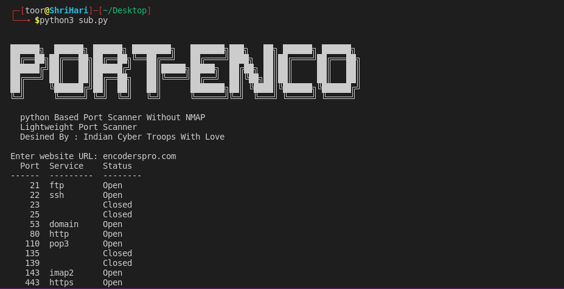

# Enco-Port
This script scans for open ports on a user-specified website or IP address and generates a table of results including port number, service, and status. The script automatically scans for commonly used ports and outputs the results in an easy-to-read format using the tabulate library
you can add ports manually, and you can modify script and kindly give credit to owner 
 Don't Worry Tool is 100% safe as designed By Indian Cyber Troops with your Trust

## Designed By : Krishanu Sharma | And Whole ICT Team
<p>
 <a href="https://www.youtube.com/c/indiancybertroops">
    
  </a>
    <a href="https://instagram.com/indiancybertroops">
    
  </a>
     <a href="https://t.me/indiancybertroops">
    
  </a>

</p>
   
   


### Team Indian Cyber Troops:
>Created By : Indian Cyber Troops

# Features:
>Easy to Install

>Easy to Use

>Easy To Execue

>Fastest 

>Low Bandwith/Data Consume

>Scans a list of commonly used ports on a given IP address or website provided by the user

>Determines whether each port is open or closed

>Provides basic information about each open port, such as its number, associated service, and status

>Outputs the results in a formatted table using the Tabulate library

# Main Proxy-me Image

# Installation :
> clone via git clone

```
git clone https://github.com/indiancybertroops/Enco-Port
```
```
cd Enco-Port
```
```
chmod +777 *
```
```
python3 Enco-Port.py
```


# Github Status
[](https://github.com/indiancybertroops "Stats")<br>

## Contact Us: 


>Instagram
https://instagram.com/krishanuIND
>Instagram
https://instagram.com/Indiancybertroops
